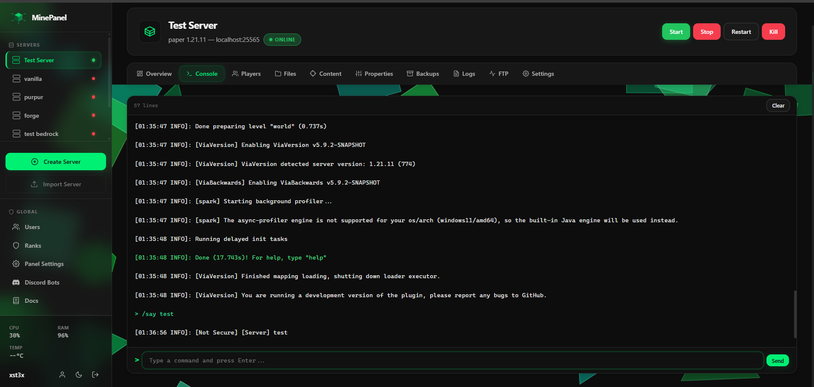
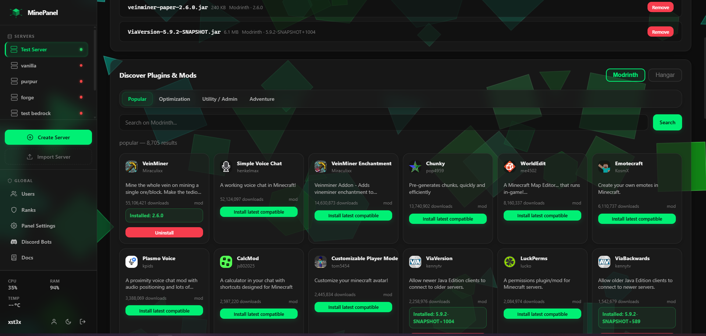
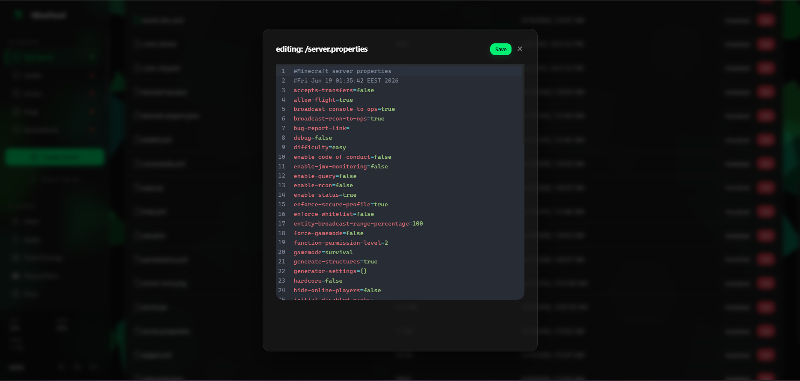
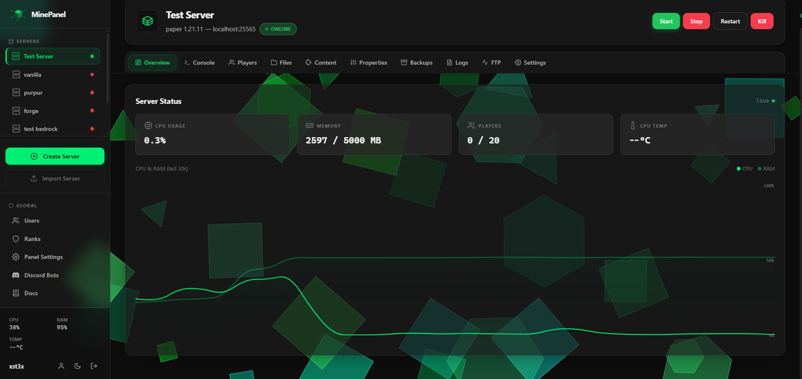
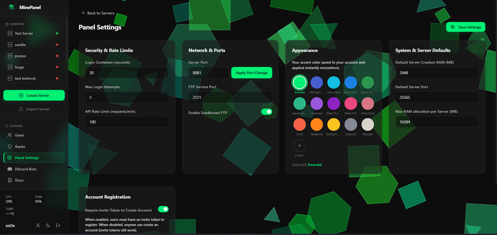

<div align="center">

# MinePanel

**A self-hosted Minecraft server management panel**

[](https://nodejs.org)
[](https://react.dev)
[](https://vitejs.dev)
[](https://sqlite.org)
[](https://python.org)
[](https://developer.mozilla.org/en-US/docs/Web/API/WebSocket)
[](LICENSE)
[](https://github.com)

Multi-server · Real-time console · Role-based access · Server automations · No external services

</div>

---

MinePanel is a lightweight, self-hosted web panel for managing Minecraft servers. Built on Node.js + Express with a React frontend and real-time WebSocket console, it gives you full control over your servers from any browser — no Docker, no cloud account, no monthly fees.

> Designed for homelabs, small communities, and server networks that want a clean interface without the bloat.

---

## Features

<details>
<summary><strong>Server Management</strong></summary>

- **Multi-server support** — create, start, stop, restart, and kill any number of servers
- **Java & Bedrock support** — run Java Edition (Paper, Vanilla, Fabric, Forge, Quilt, Magma, Purpur) and Bedrock Dedicated Server, PocketMine-MP, WaterdogPE, and more
- **Version management** — switch Minecraft versions or server software with auto-backup rollback
- **Forge installer** — automated installation for modern (1.17+) and legacy (≤1.16) formats
- **Server import** — import existing servers from `.zip` archives with automatic detection
- **Server icon upload** — upload custom PNG icons from the Properties tab

</details>

<details>
<summary><strong>Real-Time Console</strong></summary>

- **Live WebSocket console** — stream server stdout/stderr directly in the browser with zero latency
- **Command input** — send commands to the server from the panel (permission-gated)
- **Console history** — buffered per-server in memory with automatic replay on new connections
- **Log archiving** — server logs are stored and searchable via the Logs tab

</details>

<details>
<summary><strong>File Manager</strong></summary>

- **Full file browser** — browse, create, rename, delete files and folders with drag-and-drop
- **In-browser editor** — CodeMirror with syntax highlighting for `.yml`, `.json`, `.properties`, `.sh`, `.py`, and more
- **Upload & download** — upload single files (up to 100 MB); download files or entire folders as `.zip`
- **One-time download tokens** — secure temporary links for folder downloads (auto-expire in 5 minutes)
- **Path traversal protection** — all paths are sandboxed to the server directory

</details>

<details>
<summary><strong>Plugin & Mod Management</strong></summary>

- **Modrinth integration** — search and install plugins/mods directly from the panel
- **Enable / disable** — toggle plugins/mods by renaming `.jar` ↔ `.jar.disabled`
- **Upload** — drag-and-drop JARs directly into the plugin/mod folder from the panel
- **PocketMine plugin support** — automatic detection and management of `.phar` plugins for PocketMine-MP servers

</details>

<details>
<summary><strong>Backup System</strong></summary>

- **Manual backups** — create a backup at any time with one click
- **Scheduled backups** — configure per-server backup intervals (checked hourly)
- **Restore** — restore any backup instantly (server must be offline)
- **Auto-backup on change** — rollback backup created automatically before version/software switches
- **Backup browser** — view all backups with timestamps and creation reason

</details>

<details>
<summary><strong>Server Automations</strong></summary>

- **Event-based Python scripts** — write automations that respond to `player_join`, `player_leave`, `player_chat`, `server_ready`, and `server_stop` events
- **Sandboxed execution** — scripts run in an isolated Python environment with restricted imports; only safe `minepanel` API available
- **Minecaft integration** — send commands, log messages, monitor CPU/RAM via the `minepanel` module
- **Real-time logging** — script output appears instantly in the server console
- **Validation & debugging** — AST-based validator catches errors before execution; 5-second timeout with SIGKILL safety

</details>

<details>
<summary><strong>Resource Monitoring & Throttling</strong></summary>

- **Live stats** — CPU, RAM, and temperature monitoring with real-time dashboard updates
- **Stats history** — server metrics stored in SQLite for historical analysis and trending
- **Automatic throttling** — configure per-server RAM and CPU temperature thresholds to auto-warn or gracefully stop servers
- **Progressive throttling** — CPU usage is reduced progressively (80% → 50% → 25%) as temperature rises
- **System metrics** — view live system-wide and per-server resource usage from the Overview tab

</details>

<details>
<summary><strong>User & Permission System</strong></summary>

- **Role-based access** — `admin` role has full access; `user` role is governed by the permission system
- **Granular permissions** — 25+ permission keys covering every panel action, assigned per-user per-server
- **Rank system** — define reusable permission bundles; rank edits propagate instantly to all users
- **Invite tokens** — one-time registration tokens with pre-assigned ranks
- **Account disable** — suspend users without deleting their data
- **Global permissions** — admins can assign global panel permissions (e.g., `panel.settings`, `panel.users`)

</details>

<details>
<summary><strong>Two-Factor Authentication (2FA)</strong></summary>

- **TOTP authenticator** — set up via QR code with any authenticator app (Google Authenticator, Authy, etc.)
- **Backup codes** — 8 one-time recovery codes generated on setup; regeneratable at any time
- **Login enforcement** — 2FA can be enabled/disabled independently of authenticator setup
- **Password reset via 2FA** — users with 2FA enabled can self-reset their password from the login screen using their authenticator code or a backup code
- **Admin override** — admins can force 2FA on/off for any user

</details>

<details>
<summary><strong>FTP Access</strong></summary>

- **Per-server FTP** — enable a dedicated FTP server per Minecraft server with custom credentials and port
- **Toggle on/off** — start/stop FTP access per server from the panel without restarting
- **Credentials management** — generate and manage FTP logins from the Properties tab

</details>

<details>
<summary><strong>Discord Bot Integration</strong></summary>

- **Multi-bot system** — link multiple Discord bots to manage different sets of servers
- **Live console bridge** — bidirectional console streaming between Minecraft and Discord
- **Slash commands** — remote control via `/mcs start`, `/mcs stop`, `/mcs restart`, `/mcs backup`, `/mcs logs`, `/mcs stats`
- **Zero-spam notifications** — all status notifications and console messages suppress push notifications/unread badges
- **Auto-clean logs** — console channels clear automatically on server status transitions
- **Command channel protection** — restrict execute commands to authorized channels
- **Self-healing categories** — automatic recreation of server categories and channels if deleted on Discord
- **Automatic deprovisioning** — cleans up Discord channels and roles when a bot is deleted

</details>

---

## Tech Stack

| Layer               | Technology                                 |
| ------------------- | ------------------------------------------ |
| Runtime             | Node.js 18+                                |
| Web framework       | Express 4                                  |
| Frontend            | React 18 + React Router 6                  |
| Frontend build      | Vite 5                                     |
| Real-time           | `ws` (WebSocket)                           |
| Database            | SQLite 3 (via Sequelize)                   |
| Auth                | `jsonwebtoken` + `argon2` / `bcryptjs`     |
| 2FA                 | `otplib` + `qrcode`                        |
| Automation engine   | Python 3.8+ (sandboxed + AST validator)    |
| File uploads        | Multer                                     |
| Archiving           | Archiver, adm-zip                          |
| FTP                 | ftp-srv                                    |
| Process stats       | pidusage                                   |
| Discord integration | discord.js                                 |

The frontend is a React SPA built with Vite. It is compiled automatically on first run and served as static files — no separate build step required. A legacy HTML/JavaScript interface is also available for low-bandwidth environments.

---

## Getting Started

### Prerequisites

- **Node.js** v18 or higher
- **Java** installed and in `PATH`
- **Python 3** installed (for automations engine)

### Quick Setup (Recommended)

```bash
# Windows
python setup.py

# Linux / macOS
python3 setup.py
```

### Manual Setup

```bash
git clone https://github.com/yourusername/MinePanel.git
cd MinePanel
npm install
cp .env.example .env   # set SECRET_KEY and other values
npm start
```

Open `http://localhost:8082`. On first run the default admin credentials are printed to stdout — **copy them immediately**.

> **Note:** The terminal is automatically cleared when the panel starts (`cls` on Windows, `clear` on Linux/macOS) so the startup output is always clean.

---

## Configuration

```env
PORT=8082
SECRET_KEY=your-secret-here     # required — signs all JWT tokens
JWT_EXPIRES_IN=24h
ALLOWED_ORIGINS=*               # set to your domain in production
RATE_LIMIT=100
HTTPS=false
HTTPS_KEY=certs/key.pem
HTTPS_CERT=certs/cert.pem
```

See [`docs/configuration.md`](docs/configuration.md) for the full reference including Nginx, systemd setup, and environment variables.

---

## Project Structure

```
MinePanel/
├── src/
│   ├── index.js                 # Entry point + launcher (auto-builds frontend)
│   ├── minepanel.js             # Server initialization + database setup
│   ├── core/
│   │   ├── processManager.js    # Minecraft process lifecycle + console buffer
│   │   ├── versionManager.js    # Version resolution + JAR caching
│   │   ├── resolvers/           # Software-specific version resolvers
│   │   │   ├── bedrock/         # Bedrock, PocketMine, WaterdogPE, Nukkit resolvers
│   │   │   └── ...              # Paper, Vanilla, Fabric, Forge, Purpur, Quilt, Magma
│   │   ├── automation/          # Python automation engine
│   │   │   ├── validator.py     # AST-based script validator
│   │   │   ├── sandbox_runner.py# Sandboxed Python executor
│   │   │   └── workerManager.js # Execution queue + concurrency control
│   │   ├── ftpServer.js         # Per-server FTP
│   │   ├── discord/             # Discord Bot integration
│   │   ├── statsCollector.js    # Metrics collection + historical storage
│   │   ├── throttleManager.js   # RAM/CPU throttling + temperature monitoring
│   │   └── ...
│   ├── db/
│   │   ├── database.js          # SQLite init + Sequelize models
│   │   └── migrations/          # Database schema migrations
│   ├── routes/                  # Express route handlers
│   ├── public/                  # Compiled frontend (output of Vite build)
│   ├── frontend/                # React source (Vite project)
│   │   └── src/
│   │       ├── pages/           # Route-level page components
│   │       ├── components/      # Shared components
│   │       ├── context/         # React Context (Auth, etc.)
│   │       ├── lib/             # api.js, utilities
│   │       └── styles/          # Global CSS
├── servers/                     # Per-server working directories
├── data/minepanel.db            # SQLite database
├── cache/                       # JARs, version metadata, CPU temp
├── setup.py                     # Cross-platform setup wizard
└── .env.example                 # Config template
```

---

## API Overview

All routes are under `/api/`. Most require `Authorization: Bearer <jwt>`.

| Prefix                                    | Description                                                                   |
| ----------------------------------------- | ----------------------------------------------------------------------------- |
| `POST /api/auth/login`                    | Obtain a JWT token (supports 2FA via `totpCode` field)                        |
| `POST /api/auth/forgot-check`             | Check if a username has 2FA enabled (for password reset flow)                 |
| `POST /api/auth/password-reset-with-totp` | Reset password using a TOTP or backup code                                    |
| `GET/POST /api/auth/2fa/*`                | 2FA setup, verify, toggle, disable, backup codes                              |
| `/api/servers`                            | CRUD + lifecycle + version/software change + import + throttle config         |
| `/api/servers/:id/files`                  | File manager                                                                  |
| `/api/servers/:id/plugins`                | Plugin/mod management                                                         |
| `/api/servers/:id/backups`                | Backup management                                                             |
| `/api/servers/:id/players`                | Player list + kick/ban/op                                                     |
| `/api/servers/:id/properties`             | server.properties + server icon                                               |
| `/api/servers/:id/stats`                  | Historical metrics data (CPU, RAM, player count)                              |
| `/api/servers/:id/automations`            | Server automations (CRUD + validate + execute)                                |
| `/api/servers/:id/throttle-config`        | Throttle settings (RAM threshold, CPU temp threshold, actions)                |
| `/api/servers/:id/ftp`                    | Per-server FTP                                                                |
| `/api/users`                              | User management                                                               |
| `/api/ranks`                              | Rank management                                                               |
| `/api/system`                             | System info + panel settings + versions sync + metrics                        |

WebSocket: `ws://<host>:<port>/ws?serverId=<id>` (send `{"type":"auth","token":"<jwt>"}` as first message)

---

## Permissions Reference

| Key                                                     | Group      |
| ------------------------------------------------------- | ---------- |
| `server.start` / `stop` / `restart` / `kill`            | Lifecycle  |
| `server.console.read` / `write`                         | Console    |
| `server.files.read` / `write` / `delete`                | Files      |
| `server.players.read` / `kick` / `ban` / `op`           | Players    |
| `server.plugins.read` / `manage`                        | Plugins    |
| `server.backups.read` / `create` / `restore` / `delete` | Backups    |
| `server.properties.read` / `write`                      | Properties |
| `server.logs.read`                                      | Logs       |
| `server.automations.read` / `write` / `execute`         | Automations |
| `server.ftp.access` / `manage`                          | FTP        |
| `account.manage`                                        | Global     |
| `panel.settings` / `users` / `ranks` / `discord`         | Global     |

---

## UI & Frontend Notes

The frontend is a React 18 SPA using React Router 6 for client-side routing. Key design decisions:

- **No `alert()` / `confirm()`** — all notifications use a custom `Toast` component; all destructive confirmations use a custom `showConfirm()` modal
- **Animated background** — a canvas-based geometric shapes animation runs behind the layout; the sidebar is always fully opaque and rendered above it
- **Strict layout** — the sidebar has fixed dimensions (`240px` desktop, `280px` mobile drawer) enforced with `!important` to prevent layout shifts at any viewport size
- **Mobile responsive** — below `768px` the sidebar collapses to an off-canvas drawer toggled by a hamburger button; a fixed top bar replaces the sidebar header
- **Server Overview** — displays CPU, memory, players, temperature, and 30-second sparkline chart; quick actions and FTP info shown below
- **Password reset flow** — users can self-reset via 2FA code if enabled; admins can reset via database
- **Accent color customization** — 15 built-in presets plus custom color picker; light/dark mode toggle
- **Legacy interface** — fallback HTML/JavaScript interface available for low-bandwidth or accessibility needs

---

## Screenshots

Here are some UI screenshots of MinePanel:







---

## Documentation

Full docs are available in the [`docs/`](docs/) folder and inside the panel under **Docs**.

- [Getting Started](docs/getting-started.md)
- [Server Management](docs/server-management.md)
- [Users & Permissions](docs/users-permissions.md)
- [Ranks](docs/ranks.md)
- [Configuration](docs/configuration.md)
- [Automations](docs/automations.md) — event-based Python scripting guide
- [Discord Bot Integration](docs/discord-bot.md)

Developer documentation is available in [`docs/automations.md`](docs/automations.md) with complete API reference.

---

## Contributing

Contributions are welcome! If you find bugs or have feature suggestions, please open an issue or submit a pull request.

---

## License

GNU GPLv3 — free to use, modify, and distribute.

---

**Made with ❤️ for Minecraft server administrators.**
EOF