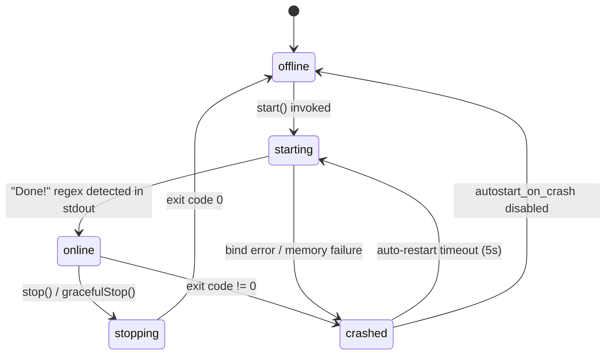

# Domain Concept: Server Instance Lifecycle States

The operational state machine governing Minecraft child processes.

## State Definitions
- **`offline`**: Process is not running. Files can be safely edited, restored, or deleted.
- **`starting`**: Process spawned; waiting for initialization string in stdout.
- **`online`**: Server accepting player connections; console accepts commands.
- **`stopping`**: Shutdown signal dispatched; waiting for clean exit.
- **`crashed`**: Process exited unexpectedly.
