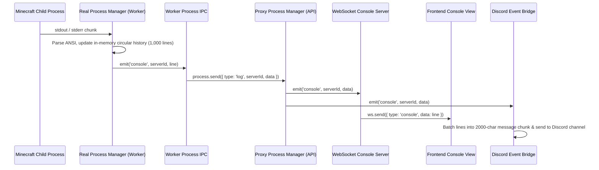

# Data Flow: Live Console Streaming

Traces how server console stdout/stderr lines travel in real time from the Minecraft operating system process to browser terminals and Discord channels.

## Key Architectural Highlights
- **Process Isolation**: The API server never directly handles stdout streams or process pipes; all IPC is non-blocking.
- **Backlog Replay**: When a browser connects to `/ws`, the proxy serves the latest 1,000 lines instantly from memory.
- **Zero-Spam Batching**: Discord forwarding batches logs to avoid hitting Discord REST rate limits.
