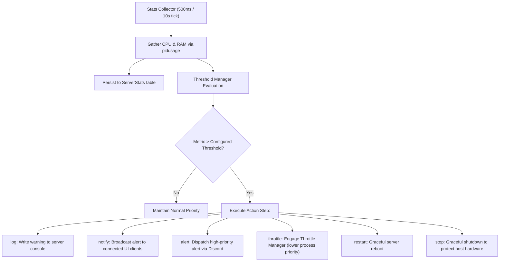

# Data Flow: Multi-Threshold Safety Ladder

Traces how server telemetry is continuously monitored against ordered safety escalation ladders.

```mermaid
flowchart TD
    StatsCollector["Stats Collector (500ms / 10s tick)"] --> Sample["Gather CPU & RAM via pidusage"]
    Sample --> DB["Persist to ServerStats table"]
    Sample --> ThresholdMgr["Threshold Manager Evaluation"]
    ThresholdMgr --> CheckLadder{"Metric > Configured Threshold?"}
    CheckLadder -- No --> Idle["Maintain Normal Priority"]
    CheckLadder -- Yes --> Actions["Execute Action Step:"]
    Actions --> ActLog["log: Write warning to server console"]
    Actions --> ActNotify["notify: Broadcast alert to connected UI clients"]
    Actions --> ActAlert["alert: Dispatch high-priority alert via Discord"]
    Actions --> ActThrottle["throttle: Engage Throttle Manager (lower process priority)"]
    Actions --> ActRestart["restart: Graceful server reboot"]
    Actions --> ActStop["stop: Graceful shutdown to protect host hardware"]
```
