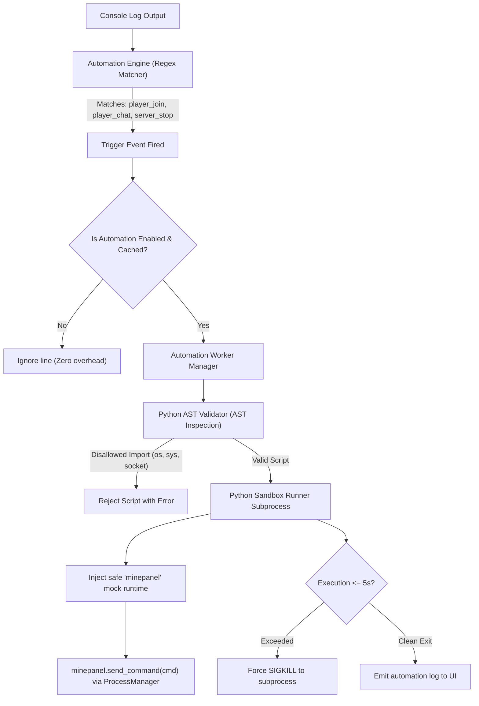

# Data Flow: Sandboxed Python Automations

Traces how Minecraft console log events trigger isolated, AST-validated Python scripts.

## Architecture Connections
- Engine: [[Automation Engine]], [[Subsystem - Server Automations Engine]]
- Python Sandbox: [[Python Sandbox Runner]], [[Python AST Validator]]
- Flow: [[Data Flow - Sandboxed Python Automations]]
- UI View: [[Frontend Automation View]]
