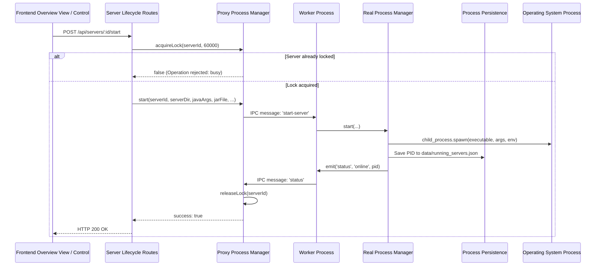

# Data Flow: Server Power Lifecycle

Traces how a user action (Start, Graceful Stop, Restart, Kill) executes safely across API locks, IPC channels, and native operating system processes.

## Key Safeguards
- **Mutex Locks**: `acquireLock(serverId)` prevents concurrent start/stop race conditions.
- **PID Persistence**: Active PIDs are saved to `data/running_servers.json` so crashes in the web panel don't terminate running servers.
