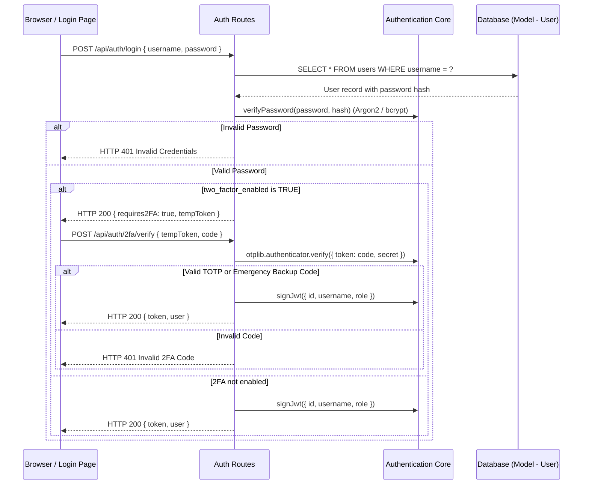

# Data Flow: Two-Factor Authentication and JWT

Traces the complete authentication lifecycle from initial credential validation to TOTP 2FA verification and JWT signing.

```mermaid
sequenceDiagram
    participant User as Browser / Login Page
    participant Route as Auth Routes
    participant Core as Authentication Core
    participant DB as Database (Model - User)

    User->>Route: POST /api/auth/login { username, password }
    Route->>DB: SELECT * FROM users WHERE username = ?
    DB-->>Route: User record with password hash
    Route->>Core: verifyPassword(password, hash) (Argon2 / bcrypt)
    alt Invalid Password
        Route-->>User: HTTP 401 Invalid Credentials
    else Valid Password
        alt two_factor_enabled is TRUE
            Route-->>User: HTTP 200 { requires2FA: true, tempToken }
            User->>Route: POST /api/auth/2fa/verify { tempToken, code }
            Route->>Core: otplib.authenticator.verify({ token: code, secret })
            alt Valid TOTP or Emergency Backup Code
                Route->>Core: signJwt({ id, username, role })
                Route-->>User: HTTP 200 { token, user }
            else Invalid Code
                Route-->>User: HTTP 401 Invalid 2FA Code
            end
        else 2FA not enabled
            Route->>Core: signJwt({ id, username, role })
            Route-->>User: HTTP 200 { token, user }
        end
    end
```
