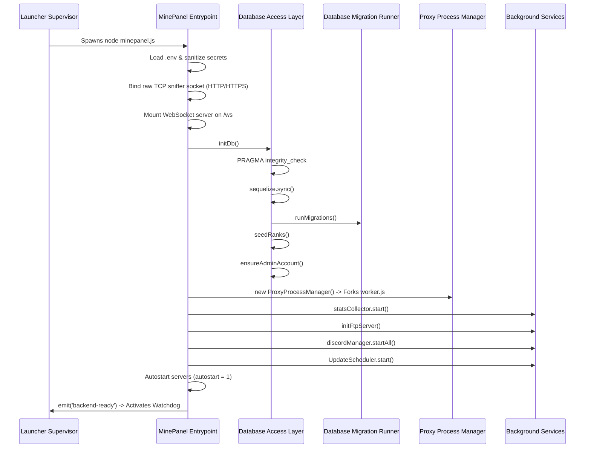

# Runtime Flow: Application Startup and Boot Sequence

Traces the step-by-step boot sequence from process invocation to accepting user requests.

```mermaid
sequenceDiagram
    participant Launcher as Launcher Supervisor
    participant Backend as MinePanel Entrypoint
    participant DB as Database Access Layer
    participant Migrator as Database Migration Runner
    participant Proxy as Proxy Process Manager
    participant Services as Background Services

    Launcher->>Backend: Spawns node minepanel.js
    Backend->>Backend: Load .env & sanitize secrets
    Backend->>Backend: Bind raw TCP sniffer socket (HTTP/HTTPS)
    Backend->>Backend: Mount WebSocket server on /ws
    Backend->>DB: initDb()
    DB->>DB: PRAGMA integrity_check
    DB->>DB: sequelize.sync()
    DB->>Migrator: runMigrations()
    DB->>DB: seedRanks()
    DB->>DB: ensureAdminAccount()
    Backend->>Proxy: new ProxyProcessManager() -> Forks worker.js
    Backend->>Services: statsCollector.start()
    Backend->>Services: initFtpServer()
    Backend->>Services: discordManager.startAll()
    Backend->>Services: UpdateScheduler.start()
    Backend->>Backend: Autostart servers (autostart = 1)
    Backend->>Launcher: emit('backend-ready') -> Activates Watchdog
```
