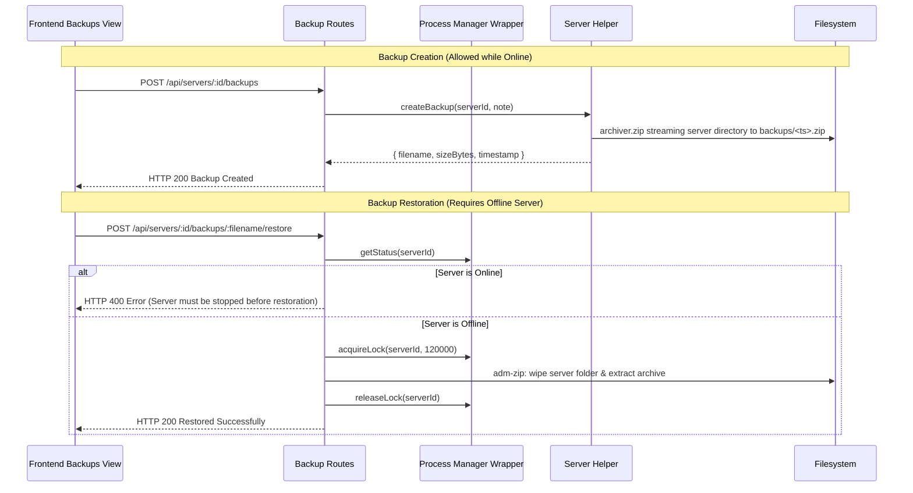

# Runtime Flow: Backup Creation and Safe Restoration

Traces creating point-in-time zip archives of a game server and restoring backups.

```mermaid
sequenceDiagram
    participant UI as Frontend Backups View
    participant Route as Backup Routes
    participant Proxy as Process Manager Wrapper
    participant Helper as Server Helper
    participant FS as Filesystem

    Note over UI,FS: Backup Creation (Allowed while Online)
    UI->>Route: POST /api/servers/:id/backups
    Route->>Helper: createBackup(serverId, note)
    Helper->>FS: archiver.zip streaming server directory to backups/<ts>.zip
    Helper-->>Route: { filename, sizeBytes, timestamp }
    Route-->>UI: HTTP 200 Backup Created

    Note over UI,FS: Backup Restoration (Requires Offline Server)
    UI->>Route: POST /api/servers/:id/backups/:filename/restore
    Route->>Proxy: getStatus(serverId)
    alt Server is Online
        Route-->>UI: HTTP 400 Error (Server must be stopped before restoration)
    else Server is Offline
        Route->>Proxy: acquireLock(serverId, 120000)
        Route->>FS: adm-zip: wipe server folder & extract archive
        Route->>Proxy: releaseLock(serverId)
        Route-->>UI: HTTP 200 Restored Successfully
    end
```
