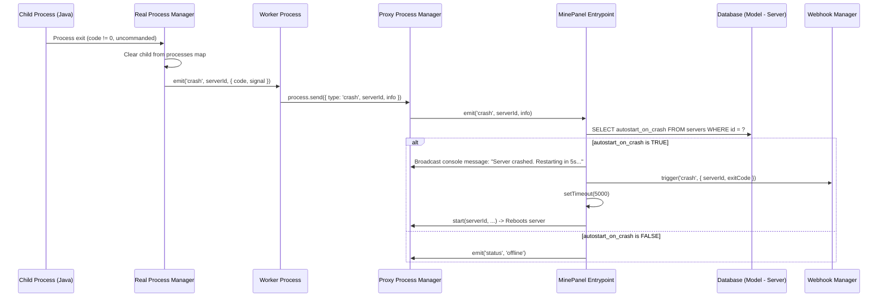

# Runtime Flow: Crash Detection and Auto-Restart Loop

Traces how an unexpected Minecraft server termination is detected, verified, and auto-restarted.

```mermaid
sequenceDiagram
    participant OS as Child Process (Java)
    participant Real as Real Process Manager
    participant Worker as Worker Process
    participant Proxy as Proxy Process Manager
    participant Entry as MinePanel Entrypoint
    participant DB as Database (Model - Server)
    participant WH as Webhook Manager

    OS->>Real: Process exit (code != 0, uncommanded)
    Real->>Real: Clear child from processes map
    Real->>Worker: emit('crash', serverId, { code, signal })
    Worker->>Proxy: process.send({ type: 'crash', serverId, info })
    Proxy->>Entry: emit('crash', serverId, info)
    Entry->>DB: SELECT autostart_on_crash FROM servers WHERE id = ?
    alt autostart_on_crash is TRUE
        Entry->>Proxy: Broadcast console message: "Server crashed. Restarting in 5s..."
        Entry->>WH: trigger('crash', { serverId, exitCode })
        Entry->>Entry: setTimeout(5000)
        Entry->>Proxy: start(serverId, ...) -> Reboots server
    else autostart_on_crash is FALSE
        Entry->>Proxy: emit('status', 'offline')
    end
```
