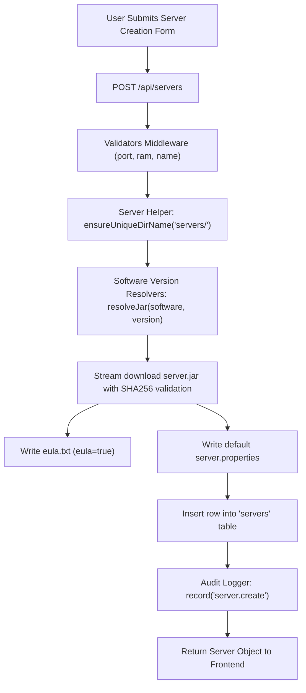

# Runtime Flow: Server Creation and Import Wizard

Traces how a new Minecraft server is provisioned from scratch or imported from a zip archive.

```mermaid
flowchart TD
    User["User Submits Server Creation Form"] --> Endpoint["POST /api/servers"]
    Endpoint --> Validate["Validators Middleware (port, ram, name)"]
    Validate --> DirCheck["Server Helper: ensureUniqueDirName('servers/<name>')"]
    DirCheck --> Resolver["Software Version Resolvers: resolveJar(software, version)"]
    Resolver --> Download["Stream download server.jar with SHA256 validation"]
    Download --> EULA["Write eula.txt (eula=true)"]
    Download --> Props["Write default server.properties"]
    Props --> DB["Insert row into 'servers' table"]
    DB --> Audit["Audit Logger: record('server.create')"]
    Audit --> UI["Return Server Object to Frontend"]
```
