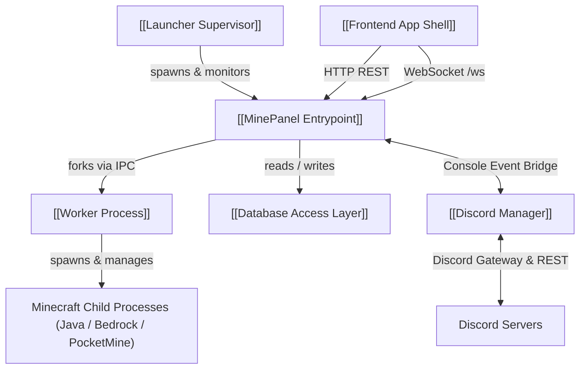

# MinePanel Architecture Knowledge Graph

**MinePanel** is a self-hosted, multi-server Minecraft management platform designed for homelabs and gaming communities. It provides zero-overhead native process isolation, real-time bidirectional console streaming, sandboxed Python automations, a rich permission and ranking system, and full Discord bot integrations without requiring external container dependencies or cloud services.

## Central Architectural Subsystems

This graph models the real structure and dependencies across the MinePanel codebase. Explore each major subsystem below:

- [[Subsystem - Supervisor and Launcher]]: Process supervisor, watchdog health monitor, crash recovery loop, and IPC protocol server.
- [[Subsystem - Core Backend and Web Server]]: Main Express 4 server, HTTP/HTTPS dual-stack sniffer socket, SFTP server, and WebSocket broadcaster.
- [[Subsystem - Process Management and Workers]]: Two-tier architecture separating the API process from execution via a dedicated worker process and IPC communication.
- [[Subsystem - Server Lifecycle and Adapters]]: Creation, startup descriptors, execution modes, and platform adapters for Java, Bedrock, and PocketMine.
- [[Subsystem - Database and Persistence]]: SQLite3 storage engine utilizing direct promise queries alongside Sequelize ORM models and migrations.
- [[Subsystem - Authentication and Permissions]]: JWT authorization, Argon2/bcrypt password hashing, TOTP 2FA, and granular per-server permissions.
- [[Subsystem - Server Automations Engine]]: Regex log streaming engine triggering sandboxed Python scripts in an AST-validated worker pool.
- [[Subsystem - Resource Monitoring and Safety]]: Multi-threshold escalation ladders (log, notify, throttle, stop) for CPU temperature and RAM.
- [[Subsystem - Discord Bot Integration]]: Multi-bot manager, bidirectional console bridge, channel auto-provisioning, and slash commands.
- [[Subsystem - Software Resolvers and Updates]]: Automated binary downloaders, version scrapers, compatibility checkers, and atomic jar updates.
- [[Subsystem - File and Backup Management]]: Sandboxed file browser, in-browser editor, zip archive streaming, and verified SQLite/directory backups.
- [[Subsystem - External Server API]]: Third-party developer API with scoped API keys, IP allowlists, and a dedicated WebSocket feed.
- [[Subsystem - Embedded FTP Server]]: In-process FTP/FTPS server with user jail isolation, TLS encryption, and granular permission enforcement.
- [[Subsystem - Frontend React Architecture]]: React 18 SPA built with Vite, utilizing React Router 6, terminal emulation, and contextual layouts.

For an alphabetical catalog of every component, visit the [[INDEX]].

## Key Architectural Decision Records (ADRs)

Understanding why MinePanel is architected this way:
- [[ADR - Dedicated Worker Process and IPC Separation]]: Complete isolation of game process execution from the web server.
- [[ADR - Dual SQLite Access Pattern (Raw Promises vs Sequelize)]]: Balancing zero-overhead SQL performance with ORM schema migrations.
- [[ADR - Mutex Locking Strategy for Server Lifecycle]]: Eliminating race conditions across concurrent API and scheduled tasks.
- [[ADR - Dual HTTP and HTTPS Sniffer Socket Routing]]: Seamless TLS dispatch and HTTP redirect on a single host port.
- [[ADR - AST-Validated Python Subprocess Isolation]]: Pre-flight static code analysis preventing RCE vulnerabilities in automations.

## Core Architectural Data Flows

Examine how messages and state propagate across the system end-to-end:
- [[Data Flow - Live Console Streaming]]: Real-time stdout capture to WebSockets and Discord.
- [[Data Flow - Server Power Lifecycle]]: Start, stop, graceful shutdown, and process persistence.
- [[Data Flow - Sandboxed Python Automations]]: Console regex triggers to AST-validated Python sandbox.
- [[Data Flow - Two-Factor Authentication and JWT]]: Login, TOTP verification, and token issuance.
- [[Data Flow - Multi-Threshold Safety Ladder]]: Hardware telemetry to CPU throttling and emergency stops.

## High-Level Execution Flow

## 🗺️ Master Plans, Audits & Strategic Roadmaps

Unified planning and audit documents integrated into this graph:
- [[MASTER_ROADMAP]]: Consolidated master development roadmap
- [[DEEP_AUDIT]]: Comprehensive 48KB deep codebase audit & health score
- [[00-GENERAL-RULES]]: Coding standards, safety rules, and architecture constraints
- [[01-STAGE_SECURITY]]: Hardening auth, rate limits, and tokens
- [[02-STAGE_ERROR_ARCHITECTURE]]: Centralized error handler and typed exceptions
- [[03-STAGE_VALIDATION]]: Input sanitization and express-validator schemas
- [[04-STAGE_LOGGING_MONITORING]]: Structured JSON logging and Prometheus telemetry
- [[05-STAGE_DATABASE]]: SQLite integrity, migrations, and indexing
- [[06-STAGE_STATISTICS_DASHBOARD]]: Historical metrics charts and player telemetry
- [[07-STAGE_TEMPLATES_WEBHOOKS]]: Webhook dispatch engine and server templates
- [[08-STAGE_COMPETITIVE_ADVANTAGES]]: MinePanel vs Crafty feature matrix & differentiators
- [[09-STAGE_PERFORMANCE]]: Event loop optimizations and memory throttling
- [[10-STAGE_TESTING_RELEASE]]: Test automation, unit suites, and CI/CD pipelines
- [[11-STAGE_DOCUMENTATION]]: Internal and operator documentation
